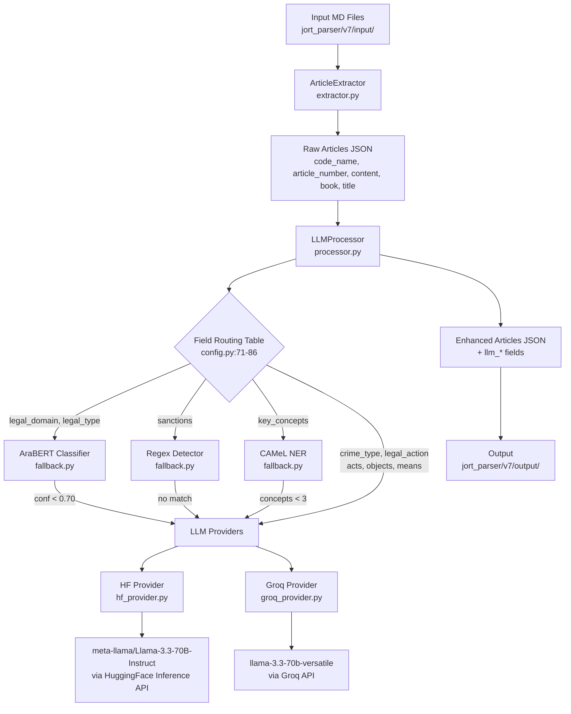
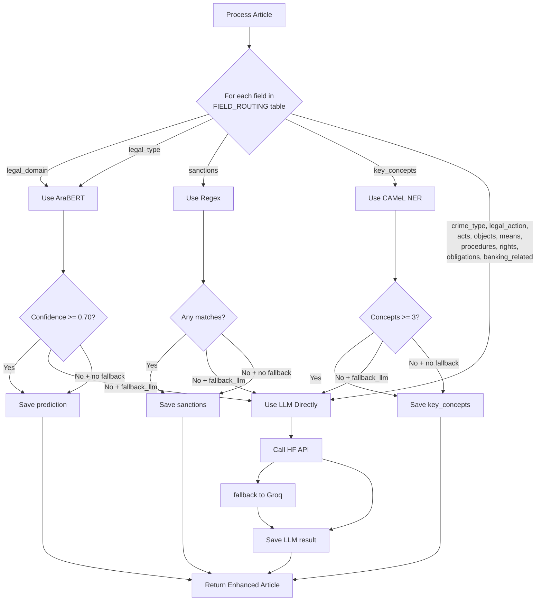
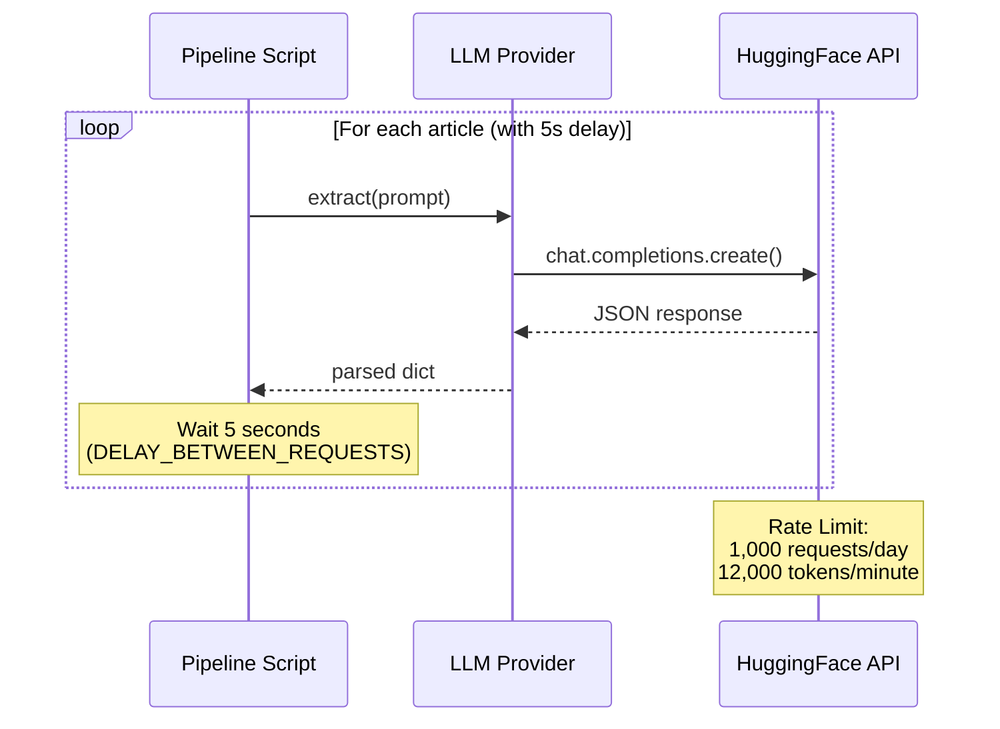

# JORT Parser v7 - Architecture Documentation

## Overview

JORT Parser v7 is a pipeline for extracting structured metadata from Arabic legal codes (MD files). It uses a combination of regex extraction, ML models (AraBERT, CAMeL NER), and LLM inference (HuggingFace + Groq) to process legal articles.

---

## 1. High-Level Data Flow



---

## 2. Component Architecture

```mermaid
graph LR
    subgraph "Input Layer"
        A1[MD Files<br/>Arabic Legal Codes]
        A2[PDF Files<br/>Optional for page mapping]
    end
    
    subgraph "Extraction Layer - extractor.py"
        B1[Regex Patterns<br/>config.py:134-141]
        B2[PyArabic<br/>utils.py]
        B3[CAMeL POS Tagger<br/>camel_tools.tagger]
        B4[Hierarchy Finder<br/>_find_hierarchy()]
    end
    
    subgraph "Processing Layer - processor.py"
        C1[Field Routing Table<br/>FIELD_ROUTING]
        C2[Cost-Aware Logic<br/>_process_field_with_tool()]
        C3[LLM Call Manager<br/>_call_llm_for_fields()]
        C4[Progress Saver<br/>save_progress()]
    end
    
    subgraph "Fallback Tools - fallback.py"
        D1[AraBERT<br/>aubmindlab/bert-base-arabertv2]
        D2[Regex Sanctions<br/>SANCTIONS_PATTERNS]
        D3[CAMeL NER<br/>CAMeL-Lab/bert-base-arabic-camelbert-mix-ner]
    end
    
    subgraph "LLM Providers - llm/"
        E1[HF Provider<br/>huggingface_hub]
        E2[Groq Provider<br/>groq client]
        E3[Base LLM Class<br/>base.py - retry logic]
    end
    
    subgraph "Output Layer"
        F1[JSON Files<br/>v7/output/]
        F2[Progress Files<br/>v7/output/progress/]
    end
    
    A1 --> B1
    A1 --> B2
    B1 --> B4
    B3 --> B4
    B4 --> C1
    C1 --> D1
    C1 --> D2
    C1 --> D3
    C1 --> E1
    E1 --> E3
    D1 --> C2
    D2 --> C2
    D3 --> C2
    C2 --> C3
    C3 --> E1
    C3 --> E2
    C3 --> F1
```

---

## 3. Field Routing Logic

The `FIELD_ROUTING` table in `config.py:71-86` determines which tool processes each field:



### Field Routing Table

| Field | Tool | Fallback to LLM? | Threshold | Output Field |
|-------|------|------------------|-----------|--------------|
| `legal_domain` | AraBERT | Yes | 0.70 | `llm_legal_domain` |
| `legal_type` | AraBERT | Yes | 0.70 | `llm_legal_type` |
| `sanctions` | Regex | Yes | None | `llm_sanctions` |
| `key_concepts` | CAMeL NER | Yes | 0.70 | `llm_key_concepts` |
| `crime_type` | LLM | N/A | None | `llm_crime_type` |
| `legal_action` | LLM | N/A | None | `llm_legal_action` |
| `acts` | LLM | N/A | None | `llm_acts` |
| `objects` | LLM | N/A | None | `llm_objects` |
| `means` | LLM | N/A | None | `llm_means` |
| `intent` | Keyword | Yes | None | `llm_intent` |
| `procedures` | LLM | N/A | None | `llm_procedures` |
| `rights` | LLM | N/A | None | `llm_rights` |
| `obligations` | LLM | N/A | None | `llm_obligations` |
| `banking_related` | LLM | N/A | None | `llm_banking_related` |

---

## 4. Tools & Libraries Summary

### Arabic Text Processing

| Tool | Library | Used For | File |
|------|---------|----------|------|
| **PyArabic** | `pyarabic.araby` | Normalize Arabic text, convert Arabic numerals (`convert_arabic_number()`) | `utils.py:28-91` |
| **CAMeL Tools** | `camel_tools.tagger` | POS validation for headers (`_validate_header_pos()`) | `extractor.py:18-19` |
| **CAMeL Tools** | `camel_tools.ner` | NER for `key_concepts` extraction | `fallback.py:105-153` |

### Machine Learning Models

| Model | Type | Purpose | File |
|-------|------|---------|------|
| **meta-llama/Llama-3.3-70B-Instruct** | LLM via HF Inference API | Extract `legal_action`, `crime_type`, `banking_related`, etc. | `hf_provider.py:21-89` |
| **aubmindlab/bert-base-arabertv2** | Transformer classifier | Predict `legal_domain`, `legal_type` | `fallback.py:27-68` |
| **CAMeL-Lab/bert-base-arabic-camelbert-mix-ner** | NER model | Extract `key_concepts` from articles | `fallback.py:105-153` |
| **CAMeL-Lab/bert-base-arabic-camelbert-da-ner** | NER model (fallback) | Fallback if mix-ner fails | `fallback.py:119-124` |

### API & Inference

| Provider | Library | Rate Limit | File |
|----------|---------|-----------|------|
| **HuggingFace** | `huggingface_hub.InferenceClient` | 1,000 req/day, 12,000 tokens/min | `hf_provider.py` |
| **Groq** | `groq` client | Fallback when HF fails | `groq_provider.py` |

### Other Libraries

| Library | Purpose | File |
|----------|---------|------|
| `re` | Regex patterns for article boundaries (`ARTICLE_PATTERNS`) | `extractor.py:82-106` |
| `fitz` (PyMuPDF) | PDF text extraction for page mapping | `extractor.py:52-63` |
| `json_repair` | Fix malformed JSON from LLM outputs | `utils.py:98-134` |
| `transformers.pipeline` | AraBERT classifier initialization | `fallback.py:34-43` |

---

## 5. Request Rate Limiting



### Rate Limiting Configuration

| Setting | Value | Location |
|----------|-------|----------|
| `DELAY_BETWEEN_REQUESTS` | 5 seconds | `run_v7_pipeline.py`, `run_v7_simple.py` |
| Initial delay on 429 | 15 seconds | `base.py:9` |
| Max delay (capped) | 60 seconds | `base.py:10` |
| Max retries | 5 | `base.py:11` |
| Consecutive 429s before switch | 3 | `base.py:35` |

---

## 6. File Structure

```
jort_parser/v7/
├── ARCHITECTURE.md          # This file
├── config.py                 # Centralized settings, API keys, model names, patterns
├── extractor.py             # Article extraction with regex + CAMeL POS
├── processor.py             # Field routing, cost-aware LLM calls, resume support
├── utils.py                 # PyArabic wrappers, JSON repair, progress I/O
├── fallback.py              # AraBERT, Regex Sanctions, CAMeL NER
├── run_v7_pipeline.py      # Complete pipeline script (all articles)
├── run_v7_simple.py        # Simple test script (3 articles)
├── llm/
│   ├── base.py             # Retry logic, exponential backoff
│   ├── hf_provider.py     # HuggingFace Inference Provider
│   └── groq_provider.py   # Groq Provider (fallback)
├── input/                   # Input MD files (legal codes)
│   ├── مجلة الإجراءات الجزائية.md
│   ├── مجلة الشغل.md
│   └── ...
└── output/                  # Output JSON files
    ├── v7_simple_result.json
    ├── v7_10_articles.json
    ├── مجلة الإجراءات الجزائية_v7_complete.json
    └── progress/
        └── *.json (progress files for resume)
```

---

## 7. Data Flow Example

### Input
```markdown
**الفصل 2-** بداية من تاريخ إجراء العمل بالمجلة المشار إليها...
```

### After Extraction (`extractor.py`)
```json
{
  "article_number": "2",
  "content": "بداية من تاريخ إجراء العمل بالمجلة المشار إليها...",
  "page_num": 1,
  "book": "أحكام تمهيدية",
  "title": "في الدعوى العمومية والدعوى المدنية",
  "section": null
}
```

### After LLM Processing (`processor.py`)
```json
{
  "article_number": "2",
  "content": "بداية من تاريخ إجراء العمل بالمجلة المشار إليها...",
  "page_num": 1,
  "book": "أحكام تمهيدية",
  "title": "في الدعوى العمومية والدعوى المدنية",
  "section": null,
  "llm_legal_action": "إجراء",
  "llm_crime_type": null,
  "llm_banking_related": false,
  "llm_key_concepts": ["المجلة الجنائية", "قانون المرافعات الجنائي"],
  "llm_sanctions": []
}
```

---

## 8. What's NOT Used

| Tool/Library | Status | Reason |
|--------------|--------|--------|
| **wtpsplit** | ❌ Not used | Current regex-based segmentation works after fixes |
| **Direct `requests` API calls** | ❌ Not used | Using `huggingface_hub.InferenceClient` instead |
| **Local LLM** | ❌ Not used | Using serverless HF Inference API |

---

## 9. Current Status After Fixes

✅ **Fixed duplicate article numbers** - Overlap detection in `extract_all()` (`extractor.py:162-172`)  
✅ **Fixed heading contamination** - Stop at `باب\|قسم\|كتاب` in `_extract_content()` (`extractor.py:91-106`)  
✅ **Fixed hierarchy detection** - `_find_hierarchy()` now captures all levels (`extractor.py:122-156`)  
✅ **Added 5-second delay** - Rate limiting between LLM requests (`run_v7_pipeline.py`)  
✅ **Lazy-loaded fallback models** - No more hanging at init (`processor.py:44-65`)  
✅ **Fixed syntax errors** - Clean pipeline scripts  

---

## 10. Quick Start

### Run Simple Test (3 articles)
```bash
cd "/mnt/d/projects/obsidian/second brain/10-Projects/11-Active/jort/parser/src"
source jort_parser/v7/.env
export HF_TOKEN GROQ_API_KEY
python3 run_v7_simple.py
```

### Run Full Pipeline (all articles)
```bash
cd "/mnt/d/projects/obsidian/second brain/10-Projects/11-Active/jort/parser/src"
source jort_parser/v7/.env
export HF_TOKEN GROQ_API_KEY
python3 run_v7_pipeline.py
```

### Expected Output
- **Processing rate**: ~12 articles/minute (5s delay + ~0.5s API time)
- **Output file**: `jort_parser/v7/output/{code_name}_v7_complete.json`
- **LLM fields**: `llm_legal_action`, `llm_crime_type`, `llm_banking_related`, `llm_key_concepts`, `llm_sanctions`

---

*Last updated: April 2026*
